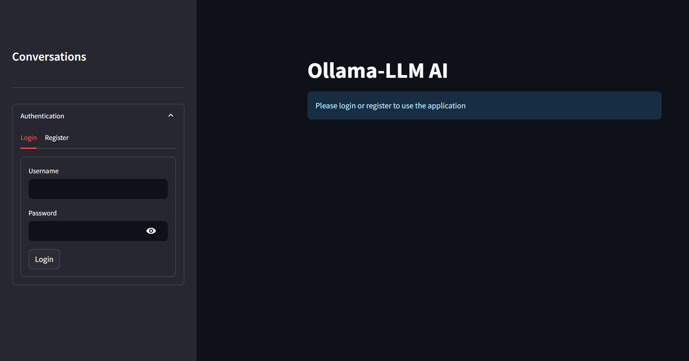
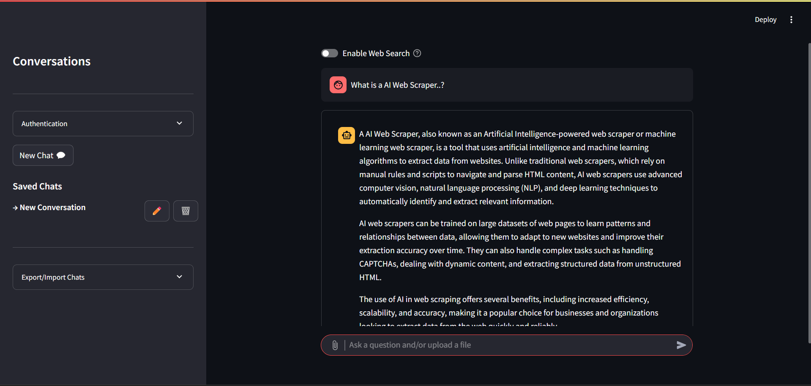

# AI-Ollama-ChatBot
AI-Ollama ChatBot is a lightweight, locally hosted chatbot built using Python and Streamlit, powered by Ollama's LLM models. It processes user input in real time, performs intelligent text analysis, and delivers contextual responses. Ideal for AI research, learning, and offline experimentation.

<h1 align="center">🤖 AI-Ollama ChatBot</h1>

<p align="center">
  A locally hosted AI chatbot powered by Ollama's LLMs, built with Python, Streamlit, SQLite3, SerpAPI, and SerperAPI.
</p>

---

## 📸 Preview

<!-- Add your screenshots below -->
<p align="center">
  
  <br/>
  <em>Streamlit-based UI for chat interaction</em>
</p>

<p align="center">
  
  <br/>
  <em>SQLite3-powered authentication screen</em>
</p>

---

## 🚀 Features

- 🔐 User authentication using **SQLite3**
- 🧠 Local AI with **Ollama's LLM models**
- 🌐 Web search powered by **SerpAPI** and **SerperAPI**
- 💬 Interactive, real-time responses
- 💻 Clean, modern interface using **Streamlit**

---

## ⚙️ Installation

1. Clone the repository:
   ```bash
   git clone https://github.com/DEVprasad7/AI-Ollama-ChatBot.git
   cd AI-Ollama-ChatBot

2. Installing Dependencies:
   ```bash
   pip install -r requirements.txt

3. Ollama LLM Installation:
    Install Ollama On Your Local Machine : https://ollama.com

    ```bash
    ollama pull <model.name>

4. Starting Ollama:
    ```bash
    ollama serve